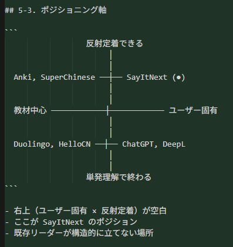

# ポジショニング図（ドラフト）

`customer-discovery.md` の **5-3. ポジショニング軸** と同じ2軸で整理する。下記の **参照PNG** がマスターイメージ（ユーザー承認版）。

---

## 画像ファイル

### 参照PNG（マスター）

- ファイル: [`positioning-axis-reference.png`](./positioning-axis-reference.png)

### SVG（編集用・再出力用）

[`positioning-map.svg`](./positioning-map.svg) — 上記と**同じ軸ラベル・象限の置き**をベクターで再現。スライド用に色や位置を微調整するときに使う。

---

## 2軸の定義（約束）

| 軸 | 左／下 | 右／上 |
|----|--------|--------|
| **横軸** | **教材中心**（アプリ／出版社が用意したカリキュラムが主） | **ユーザー固有**（自分の一言・自分の場面が学習の起点） |
| **縦軸** | **単発理解で終わる**（その場は分かるが、SRS 等で「口から出る」まで繋がらない） | **反射定着できる**（反復・想起練習までがプロダクトに含まれる） |

**注意**: 座標は**概念的**であり、シェアや売上の定量プロットではない。

---

## 象限ごとの置き（承認版）

| 象限 | 載せる例 | 読み |
|------|----------|------|
| **左上** | Anki, SuperChinese | 教材（公式系・デッキ／HSK体系）寄りだが、SRS 等で**定着ループ**は強い。 |
| **左下** | Duolingo, HelloCN | 教材中心で、体験は**単発の理解・クリア**に寄りやすい。 |
| **右下** | ChatGPT, DeepL | 入力は**ユーザー固有**だが、保存・SRS まで含まないと**単発で終わりやすい**。 |
| **右上** | **SayItNext（●）** | **ユーザー固有 × 反射定着できる**の交点。既存大手が構造的に取りにくい隙、という主張。 |

HelloCN = HelloChinese の略表記（図面用）。

---

## 更新手順

1. 軸の定義が変わったら、まず **5-3 のASCII** と **参照PNG** を更新し、次に `positioning-map.svg` を合わせる。
2. ブランド名確定後、`SayItNext` の表記を差し替える。

---

## 関連

- [`customer-discovery.md`](./customer-discovery.md) — 5-3 ポジショニング軸
- [`competitor-analysis.md`](./competitor-analysis.md) — 競合一覧・差別化
