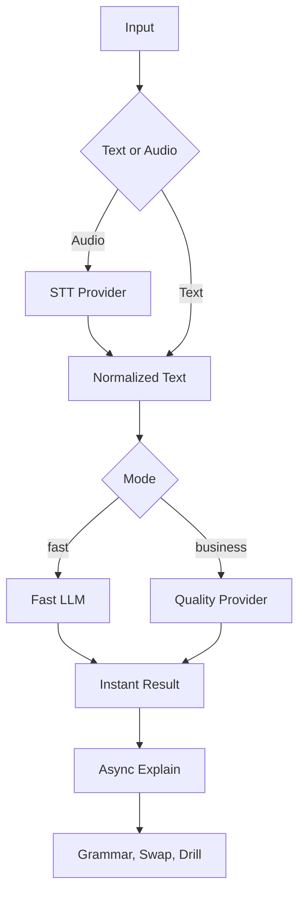

# 翻訳・音声基盤 Provider 評価

**作成日**: 2026-05-21  
**目的**: 翻訳精度・速度・コストを中心に、音声入力、専門用語、ピンイン、学習資産化、中国本土/マカオ利用まで含めて最適なprovider構成を決める。  
**参照元**: `customer-understanding-synthesis.md`、`interviews/observation-009-urano-china-resident-business.md`、現行実装 `src/app/api/phrase/add/route.ts` / `src/app/api/phrase/explain/route.ts`

---

## 0. 結論

単一providerで全部を解こうとしない。

現時点の最適解は、**即時翻訳・音声認識・解説生成・専門用語保持を分離するハイブリッド構成**。

1. **短期MVP**: 現行の Gemini Flash-Lite 継続。即時翻訳と解説生成を分ける構成は正しい。
2. **最優先改善**: 音声入力は Web Speech API 依存をやめ、録音→サーバーSTTをPoCする。
3. **中期**: `通常モード` と `仕事/高精度モード` を分ける。
4. **中国本土/駐在者対応**: Azure Speech / Azure Translator、または中国系providerをfallback候補にする。
5. **専門用語対応**: いきなり大規模glossaryではなく、まずアプリ内の簡易用語辞書をプロンプトへ渡す。

---

## 1. 評価軸

### 必須評価軸

- **精度**: 意味落ち、専門用語保持、自然さ、場面適合、丁寧さ。
- **速度**: 会話中に待てるか。目安は1〜2秒、3秒超で待たされ感。
- **コスト**: 1回あたりの入力/出力/音声コスト。利用増加時に破綻しないか。

### 追加で見るべき評価軸

- **中国本土/マカオからの到達性**: ユーザー端末、Vercel、API providerの経路。
- **音声入力の安定性**: iOS Safari、Android Chrome、Discord/WeChat内ブラウザ、会社Wi-Fi、VPN有無。
- **ピンイン品質**: 声調記号付き、簡体字との対応、説明内の中国語にも付くか。
- **JSON安定性**: APIレスポンスを壊さずパースできるか。
- **専門用語/固有名詞**: SUS、ステンレス、社内略語、ホテル/ポーカー用語。
- **プライバシー/業務情報**: 入力データがどこに送られ、どこに保存されるか。
- **fallback容易性**: provider障害・地域制限時に切り替えられるか。
- **キャッシュ可能性**: 同じフレーズ、同じ解説、同じ専門用語辞書の再利用。
- **学習資産化**: 単語分解、文法パターン、入れ替え例、自動出題まで作れるか。

---

## 2. 評価セット

スコアリングは各providerで同一入力を投げ、以下を5段階で評価する。

- 正確性
- 自然さ
- 速度
- ピンイン品質
- 専門用語保持
- JSON安定性
- 学習資産化しやすさ

### 2.1 日→中: 駐在実務

| ID | 入力 | 想定場面 | 見たいこと |
|---|---|---|---|
| BIZ-JA-01 | 4時から5時の間にガス点検の人が来る場合、私は先に家で待機していた方がいいですか？ | 生活手続き/事務員 | 自然な長めの依頼、時間表現、丁寧さ |
| BIZ-JA-02 | 今日はSUSの部品を確認してから、ステンレスの材料を発注してください。 | 製造業/部下指示 | SUSとステンレスを落とさない |
| BIZ-JA-03 | この変更点は通常の流れではないので、先に通訳者を入れて説明したいです。 | 業務変更点 | 異常/通常フロー、通訳者の自然表現 |
| BIZ-JA-04 | すぐ対応できますが、今日中に完了できるという意味ではありません。 | 納期/責任範囲 | 「できる」の誤解回避 |
| BIZ-JA-05 | ここだけ寸法が違うので、図面番号を確認してから作業してください。 | 製造業/専門指示 | 図面番号、寸法、作業指示 |
| BIZ-JA-06 | 先に家で待っていた方がいいのか、それとも到着前に連絡をもらえるのか確認してください。 | 生活/仕事中の依頼 | 自然な一文を短文分割せず訳せるか |
| BIZ-JA-07 | この話は社内確認が必要なので、今はまだお客様には伝えないでください。 | 業務連絡 | 社内確認、顧客への未連絡 |
| BIZ-JA-08 | もし英語が難しければ、翻訳アプリを使いながら短く確認します。 | 会話開始 | 翻訳アプリ利用を自然に伝える |

### 2.2 日→中: マカオ/ポーカー/旅行

| ID | 入力 | 想定場面 | 見たいこと |
|---|---|---|---|
| POKER-JA-01 | シートチェンジしたいです。空いたら教えてください。 | ポーカールーム | 現場で短く自然 |
| POKER-JA-02 | この席でプレイしてもいいですか？ | ポーカー卓 | 短文・丁寧さ |
| POKER-JA-03 | チップを両替したいです。 | カジノ/フロア | カジノ文脈 |
| POKER-JA-04 | もう一杯水をください。 | 卓/レストラン | 日常定型 |
| POKER-JA-05 | タクシーでこのホテルまで行きたいです。 | 移動 | 場所指示 |

### 2.3 中→日: 聞き取り/相手発話

| ID | 入力 | 想定場面 | 見たいこと |
|---|---|---|---|
| ZH-JA-01 | 你要不要换座位？ | ポーカー/席 | 自然な日本語、疑問文 |
| ZH-JA-02 | 师傅大概四点到五点之间会过去。 | 生活手続き | 時間幅と「師傅」の解釈 |
| ZH-JA-03 | 这个材料不是不锈钢，是普通钢。 | 製造業 | 材料種別、専門語 |
| ZH-JA-04 | 这个今天可以开始，但是不一定今天完成。 | 納期 | 誤解のない日本語 |
| ZH-JA-05 | 你先等一下，经理马上过来。 | カジノ/店舗 | 待機・担当者 |

### 2.4 音声入力テスト

| ID | 発話 | 言語 | 見たいこと |
|---|---|---|---|
| STT-JA-01 | 4時から5時の間にガス点検の人が来る場合、私は先に家で待機していた方がいいですか？ | 日本語 | 長文・数字・自然発話 |
| STT-JA-02 | SUSの部品とステンレスの材料を確認してください。 | 日本語 | 英字略語、カタカナ |
| STT-JA-03 | すぐ対応できますが今日中に完了できる意味ではありません。 | 日本語 | 意味の境界 |
| STT-ZH-01 | 师傅大概四点到五点之间会过去。 | 中国語 | 普通話認識 |
| STT-ZH-02 | 这个材料不是不锈钢，是普通钢。 | 中国語 | 専門語 |

---

## 3. Provider比較

### 3.1 LLM系

| Provider | 強み | 弱み | 向いている用途 | 現時点の扱い |
|---|---|---|---|---|
| Gemini Flash-Lite | 低コスト、高速、現行実装済み、JSON出力と解説生成を一体化しやすい | Gemini APIの地域/提供条件、中国本土/マカオ規約確認が必要。専用翻訳APIほど用語集制御は強くない | 通常翻訳、ピンイン、解説生成、文法パターン化 | **短期MVPの基準provider** |
| OpenAI GPT-4o mini / GPT-4.1 mini | 低コスト、高速、翻訳/JSON/解説に強い。STTとの統合もしやすい | 中国本土からの直接利用は弱い。サーバー経由前提 | Gemini fallback、解説生成、評価比較 | **比較対象** |
| 高性能LLM（GPT-4.1, Gemini上位等） | ニュアンス、業務文脈、複数候補に強い | コストと速度 | 仕事/高精度モード、複雑な文の再確認 | **高精度モード候補** |

### 3.2 専用翻訳API

| Provider | 強み | 弱み | 向いている用途 | 現時点の扱い |
|---|---|---|---|---|
| DeepL API | 日中翻訳の自然さが強い可能性。専用翻訳で速度/安定性が期待できる | ピンイン、文法解説、自動出題は別途必要。中国本土到達性は要検証 | 純粋翻訳の比較基準 | **品質比較用** |
| Google Cloud Translation Advanced | glossaryで専門用語を制御可能。速度と安定性 | Google系の中国本土/規約リスク。ピンインや学習化は別途必要 | 専門用語ありの業務翻訳 | **用語集候補** |
| Azure Translator | 中国本土/法人利用との相性が比較的よい。Azure Chinaも選択肢 | 日本個人開発から中国Azure利用は手続き/契約確認が必要 | 駐在/仕事向け、本土fallback | **中期本命候補** |
| Baidu Translate | 中国本土で安定しやすい。価格も比較的安い | 日本語品質・自然さ・開発者体験は要実測。ピンイン/学習化は別途 | 中国本土fallback | **本土向け候補** |
| Tencent/Alibaba MT | 中国内インフラで使いやすい可能性 | サービス継続性/対応言語/品質要確認。Tencent MTは将来移行情報あり | 中国本土fallback | **要注意候補** |

### 3.3 STT/音声認識

| Provider | 強み | 弱み | 向いている用途 | 現時点の扱い |
|---|---|---|---|---|
| Web Speech API | 実装が軽い。ブラウザだけで使える | 浦野様環境で `NotAllowed`。ブラウザ/中国本土/アプリ内ブラウザ依存が大きい | 補助機能 | **主機能にはしない** |
| OpenAI Whisper / GPT-4o Transcribe | 実装しやすい、多言語対応、精度期待値高い | 中国本土の直接利用は弱い。サーバー経由前提。リアルタイム性は設計次第 | 短期PoC | **最短PoC候補** |
| Azure Speech | 日本語/中国語、多言語、法人/中国本土展開で強い。Azure Chinaも選択肢 | 設定がやや重い。地域/契約確認が必要 | 駐在者向け本命STT | **中期本命候補** |
| Google Cloud Speech-to-Text | 精度期待値高い。Chirp系 | Google系の地域/本土リスク | 日本/マカオ中心なら候補 | **比較対象** |
| iFlytek | 中国語音声で強い。本土利用に強い可能性 | 日本語認識や開発運用は要検証。価格は呼び出し課金 | 中国本土fallback | **本土特化候補** |

---

## 3.4 ベンチマーク採点ルール

### 翻訳スコア

各評価文ごとに、以下を1〜5点で採点する。

| 評価項目 | 5点 | 3点 | 1点 |
|---|---|---|---|
| 意味の正確性 | 意味落ちなし | 大意は合うが一部曖昧 | 重要意味が落ちる/逆になる |
| 自然さ | 現地でそのまま使える | 通じるが翻訳調 | 不自然/失礼/意味不明 |
| 場面適合 | ポーカー/仕事/生活に合う | 汎用表現 | 場面に合わない |
| 専門用語保持 | SUS/ステンレス等が正しく残る | 一部補足が必要 | 消える/誤訳 |
| ピンイン品質 | 声調記号付きで正確 | だいたい正しい | なし/誤り多数 |
| JSON安定性 | 常にvalid JSON | たまに補正必要 | パース不能 |

### 速度スコア

| レイテンシ | 評価 |
|---:|---|
| 0〜1.5秒 | 会話中でも使いやすい |
| 1.5〜3秒 | 許容範囲 |
| 3〜5秒 | 会話中は重いが学習/仕事確認なら可 |
| 5秒超 | 即時翻訳には不向き |

### コストスコア

MVPでは絶対額より、**利用増加時に説明できる単価**を重視する。

記録する値:

- 入力文字数/トークン数
- 出力文字数/トークン数
- 音声秒数
- provider公称単価
- 推定1回単価
- 100回/日、1,000回/日、10,000回/日の月額換算

### 合格ライン

| 用途 | 合格ライン |
|---|---|
| `fast` | 3秒以内、意味の正確性4以上、JSON安定性5 |
| `business` | 5秒以内、意味の正確性5、専門用語保持4以上 |
| `explain` | 10秒以内、文法パターン/入れ替え例の有用性4以上 |
| `stt` | 録音終了後3秒以内、自然発話と専門語の認識が実用範囲 |

### ベンチマーク記録テンプレ

```text
provider:
model:
mode:
input_id:
latency_ms:
input_units:
output_units:
estimated_cost_usd:
valid_json: yes/no
accuracy_score:
naturalness_score:
context_fit_score:
terminology_score:
pinyin_score:
notes:
```

---

## 4. コスト感

概算。実際の請求は利用量、モデル、為替、プラン、provider更新で変わる。

| Provider | 価格感 | コメント |
|---|---:|---|
| Gemini Flash-Lite | 入力 $0.25 / 1M tokens、出力 $1.50 / 1M tokens 程度 | 現MVPには十分安い。長い解説を出すと出力側コストが増える |
| GPT-4o mini | 入力 $0.15 / 1M tokens、出力 $0.60 / 1M tokens 程度 | 低コストLLM候補。比較価値あり |
| GPT-4.1 mini | 入力 $0.40 / 1M tokens、出力 $1.60 / 1M tokens 程度 | Gemini Flash-Liteに近い価格帯 |
| DeepL API Pro | 月額 + $25 / 1M characters 程度 | 純粋翻訳は文字課金。短文大量利用では読みやすい |
| Google Cloud Translation NMT | $20 / 1M characters 程度 | glossary利用ならAdvanced |
| Azure Translator | 文字課金。無料枠あり | 中国/法人利用も見据えるなら比較対象 |
| Baidu Translate | 49元 / 1M characters 程度 | 本土fallbackとして安い可能性 |
| OpenAI Whisper | $0.006 / minute 程度 | 音声PoCとして安い |
| Azure Speech fast transcription | $0.36 / hour 程度 | 録音→文字起こしに強い候補 |
| Google STT v2 | $0.016 / minute 程度 | 比較対象 |

### コスト上の重要ポイント

- 翻訳だけなら専用翻訳APIの文字課金が分かりやすい。
- ただし、このアプリは「翻訳 + ピンイン + 解説 + ドリル化」なので、LLMが完全には外れない。
- コストの主犯は、短い翻訳ではなく**長い解説生成**になりやすい。
- 現行の「即時翻訳はfast、解説は後段」はコスト/速度の両面で正しい。
- キャッシュ対象:
  - 入力文 + 方向 + モード + glossary version
  - 解説生成
  - ピンイン生成

---

## 5. 推奨provider routing

### 5.1 モード定義

| モード | 目的 | 推奨provider | 出力 |
|---|---|---|---|
| `fast` | 会話中にすぐ出す | Gemini Flash-Lite継続。OpenAI miniを比較 | 翻訳、ピンイン、最小JSON |
| `business` | 仕事/専門用語/自然入力 | Gemini上位 or Azure/Google Translation + LLM | 翻訳、ピンイン、専門用語保持、注意点 |
| `explain` | 後から学習化 | Gemini Flash-Lite or OpenAI mini | 単語、文法、入れ替え例、自動出題 |
| `stt` | 音声→テキスト | OpenAI WhisperでPoC、Azure Speechを本命比較 | transcript、言語、confidence相当 |
| `fallback-cn` | 中国本土で不安定な時 | Azure China / Baidu / iFlytek | 最低限の翻訳/音声認識 |

### 5.2 推奨処理フロー

1. 音声入力なら `stt` で文字化。
2. `fast` で即時翻訳を返す。
3. `after()` またはクライアント側の追加リクエストで `explain` を実行。
4. 仕事カテゴリ/専門用語検出時は `business` を選ぶ。
5. provider失敗時はfallbackへ切り替える。



### 5.3 Provider抽象化の型案

`src/lib/server/translation-providers.ts` に寄せる想定。

```ts
type TranslationMode = "fast" | "business" | "explain";
type TranslationProvider =
  | "gemini-flash-lite"
  | "openai-mini"
  | "azure-translator"
  | "google-translation"
  | "baidu-translate";

type TranslateInput = {
  mode: TranslationMode;
  direction: "ja-to-zh" | "zh-to-ja";
  text: string;
  categoryId?: string | null;
  glossary?: Array<{ source: string; target: string; note?: string }>;
};

type TranslateOutput = {
  provider: TranslationProvider;
  chinese: string;
  japanese: string;
  pinyin: string;
  explanation: string;
  latencyMs: number;
  estimatedCostUsd: number | null;
  rawText?: string;
};
```

### 5.4 Routingルール案

| 条件 | mode | provider優先順 |
|---|---|---|
| 通常の短文、会話中 | `fast` | Gemini Flash-Lite → OpenAI mini |
| `categoryId === "work"` | `business` | Gemini上位/Flash-Lite business prompt → Azure Translator + LLM |
| SUS/ステンレス/図面/材料/納期等を含む | `business` | business prompt + glossary |
| 中国語→日本語の短文 | `fast` | Gemini Flash-Lite → OpenAI mini |
| 解説生成 | `explain` | Gemini Flash-Lite → OpenAI mini |
| provider timeout | 同じmode | fallback providerへ |
| 中国本土でGoogle系失敗が続く | `fast`/`business` | Azure → Baidu/Tencent/iFlytek系 |

### 5.5 Timeout / Fallback

即時翻訳では、遅い高精度よりも「まず返す」ことを優先する。

- `fast`: 3秒timeout
- `business`: 6秒timeout
- `explain`: 12秒timeout
- `stt`: 8秒timeout

fallback時に返す情報:

```json
{
  "provider": "openai-mini",
  "fallbackFrom": "gemini-flash-lite",
  "reason": "timeout",
  "requestId": "..."
}
```

### 5.6 用語辞書の初期案

まずはDBや管理画面ではなく、サーバー側の小さな辞書でよい。

```ts
const WORK_GLOSSARY = [
  { source: "SUS", target: "SUS", note: "ステンレス鋼の材料記号として保持する" },
  { source: "ステンレス", target: "不锈钢", note: "材料名" },
  { source: "図面番号", target: "图纸编号", note: "製造業の図面番号" },
  { source: "寸法", target: "尺寸", note: "製造業の寸法" },
  { source: "通訳者", target: "翻译", note: "人の通訳者" },
];
```

将来、ユーザー/会社ごとに用語辞書を持てると仕事利用に効く。

### 5.7 計測ログ

provider routingの良し悪しは、主観ではなくログで見る。

必ず保存したい項目:

- requestId
- endpoint
- mode
- provider
- fallbackFrom
- direction
- categoryId
- inputChars
- outputChars
- latencyMs
- estimatedCostUsd
- success
- errorCode
- userEditedTranscript: true/false
- sttProvider
- sttLatencyMs

既存の `recordAiUsageEvent` に近い形で拡張する。

---

## 6. STT PoC設計

### 6.1 目的

浦野様環境で起きた `NotAllowed` 系エラーと、駐在者向けに音声入力が必須に近い問題を解く。

### 6.2 最小仕様

- クライアントで `MediaRecorder` を使い、短い音声を録音。
- `src/app/api/speech/transcribe/route.ts` に `multipart/form-data` で送る。
- サーバー側でSTT providerへ送信。
- transcriptを返し、既存の `phrase/add` に流す。

### 6.2.1 API仕様案

`POST /api/speech/transcribe`

Request:

```text
multipart/form-data
- audio: Blob
- languageHint: ja-JP | zh-CN | auto
- source: add | conversation
```

Response:

```json
{
  "requestId": "string",
  "provider": "openai-whisper",
  "language": "ja-JP",
  "transcript": "SUSの部品とステンレスの材料を確認してください。",
  "durationMs": 8200,
  "latencyMs": 1300
}
```

Error:

```json
{
  "requestId": "string",
  "error": "音声の文字起こしに失敗しました。手入力で続けてください。",
  "code": "stt_failed"
}
```

### 6.2.2 クライアント仕様案

- 録音ボタンを押す。
- 最大20秒まで録音。
- 録音終了後、文字起こし中の状態を表示。
- transcriptを入力欄に入れる。
- ユーザーが編集してから送信できるようにする。
- 失敗時は入力欄を保持し、手入力案内を出す。

既存のWeb Speech APIは完全削除せず、当面はfallback/補助扱いにする。

### 6.2.3 セキュリティ/保存方針

- 音声BlobはSTT処理後に保存しない。
- transcriptだけ既存の翻訳/保存フローに流す。
- 入力データ説明に「音声入力時は文字起こしのため音声が送信される」を追記する。
- 20秒/一定ファイルサイズ上限を設ける。
- 既存の `assertWithinDailyAiLimit` と同様に、STTにも利用制限を設ける。

### 6.3 PoC provider

第一候補: **OpenAI Whisper / GPT-4o mini transcribe**

理由:

- 実装が早い。
- 多言語対応。
- 価格がPoC向き。
- サーバー経由なので、ブラウザ音声認識の権限/Google依存を回避できる。

第二候補: **Azure Speech**

理由:

- 駐在者/中国本土/法人利用を考えると中期本命。
- Azure ChinaやSpeech translationの選択肢がある。
- 日本語/中国語の両方に対応しやすい。

### 6.4 PoCで測ること

- iPhone Safariで録音できるか。
- Discord/LINE/WeChat内ブラウザで録音できるか。
- 中国本土/マカオ/VPNありなしでアップロードできるか。
- 10秒以内の短文で、録音終了から翻訳表示まで何秒か。
- `SUS`、`ステンレス`、時間表現、自然な話し言葉をどれだけ拾えるか。

### 6.4.1 実機テストマトリクス

| 環境 | 目的 |
|---|---|
| 日本 / iPhone Safari | 基準環境 |
| 日本 / Android Chrome | Android基準 |
| Discord内ブラウザ | 浦野様の再現確認 |
| マカオ / 現地SIM | 6/5以降の実地確認 |
| マカオ / ホテルWi-Fi | 旅行者環境 |
| 中国本土 / 会社Wi-Fi | 駐在者リスク確認 |
| 中国本土 / VPNあり | fallback確認 |

### 6.4.2 PoC完了条件

- iPhone Safariで録音→文字起こし→翻訳まで完了。
- Discord内ブラウザで、Web Speech APIより成功率が上がる。
- 10秒音声で録音終了からtranscript表示まで3秒以内を目指す。
- `STT-JA-01〜03` と `STT-ZH-01〜02` の評価セットで、実用上の致命的誤認識がない。

### 6.5 注意点

- 音声ファイルをサーバーに送るため、入力データ説明に音声送信の記載が必要。
- 会話中利用では、録音開始/停止のUXが最重要。
- 長時間録音ではなく、まずは10〜20秒の短文に制限する。
- STT結果は編集可能にする。誤認識ゼロは期待しない。

---

## 7. Provider別の採用判断

### 今すぐ採用

- Gemini Flash-Liteの現行継続。
- 解説生成の非同期化。
- 翻訳評価セットで品質を測る。

### 次にPoC

- OpenAI Whisper / GPT-4o mini transcribeで録音→サーバーSTT。
- OpenAI miniを翻訳providerの比較対象に追加。

### 中期で検討

- Azure Speech / Azure Translator。
- Google Cloud Translation Advanced glossary。
- Baidu Translate / iFlytek fallback。

### 今は採用しない

- Web Speech APIを主音声入力にする。
- 専用翻訳APIだけで学習化まで完結させる。
- 中国本土向けに最初からBaidu/Tencent/Alibabaへ全面移行する。

---

## 8. 実装タスク案

### P0: 評価と計測

- 評価セットを固定する。
- 現行Geminiで評価セットを実行し、結果を記録。
- レイテンシ、inputChars/outputChars、成功/失敗をprovider別に残す。

### P1: STT PoC

- `src/app/api/speech/transcribe/route.ts` を追加。
- クライアントに録音UIを追加。
- STT結果を入力欄に入れ、ユーザーが編集して送信できるようにする。

### P2: Provider抽象化

- `src/lib/server/translation-providers.ts` を追加。
- `translateWithProvider({ mode, direction, text, glossary })` を作る。
- provider、latency、costEstimate、errorCodeを返す。

### P3: Business mode

- カテゴリが `work`、またはSUS/図面/材料など専門語を含む場合に `business` を提案。
- 専門用語辞書をプロンプトに渡す。
- 必要ならGoogle/Azureのglossaryを比較。

---

## 9. 最終判断

最も良い構成は以下。

> **会話中は高速LLMで即時翻訳。音声は録音→サーバーSTT。解説・文法・自動出題は非同期LLM。仕事/専門用語は高精度モードと簡易用語辞書で補強。中国本土リスクにはAzure/中国系fallbackを準備する。**

現時点では、provider乗り換えよりも先に、**評価セットの固定**と**録音→サーバーSTTのPoC**をやるべき。

