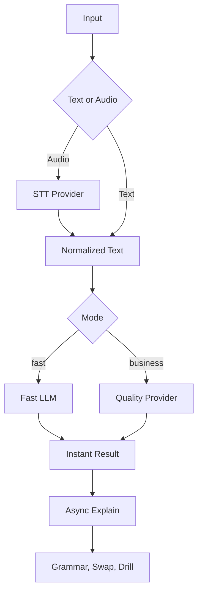

# 翻訳・音声基盤 Provider 評価

**作成日**: 2026-05-21  
**目的**: 翻訳精度・速度・コストを中心に、音声入力、専門用語、ピンイン、学習資産化、中国本土/マカオ利用まで含めて最適なprovider構成を決める。  
**参照元**: `customer-understanding-synthesis.md`、`interviews/observation-009-urano-china-resident-business.md`、現行実装 `src/app/api/phrase/add/route.ts` / `src/app/api/phrase/explain/route.ts`

---

## 2026-09-07 速度廃止とGemini/GPTの実API比較（最新）

### Gemini 3.5 Flash-Liteへのローカル切替

- 2026-09-07、品質翻訳、解説補完、例文パック生成、パック解説生成、利用記録のモデル表示を `gemini-3.5-flash-lite` に統一した。通常モードのDeepL→Azure fallback、音声、プロンプト、保存データは変更していない。
- 本番デプロイ・APIキー・DBは未変更。以下の比較結果は切替前の実API評価を含む履歴として保持する。

### GPT-5.6 Luna追加比較

- 前回の5モデル比較にGPT-5.6 Lunaが含まれていなかったため、ユーザー承認後、Gemini 3.5 Flash-Lite / Gemini 3.8 Flash / GPT-5.6 Lunaを同じ日本語10文×中国語/英語の20例で再生成した。各20件、計60件を実APIで逐次実行し、成功は60/60、失敗0、内部再生成0。保護付きPreviewのビルドで実行し、本番/DB/保存/ドリル/音声は変更していない。
- 実測中央値は3.5が2.451秒、3.8が2.862秒、Lunaが7.826秒。p90は2.883秒、3.280秒、9.722秒、最大は3.037秒、4.159秒、13.438秒。今回の条件では、待ち時間は3.5が最良で、Lunaは明確に遅い。
- 料金は返却token×公式Standard単価の推計。20件で3.5=$0.04701、3.8=$0.08633、Luna=$0.02703。1ドル150円の計算では1,000件あたり約353円、647円、203円。Lunaが最安、3.5は3.1より高いが差は小さい。実請求額、無料枠、音声/他API費用は含めない。
- 主訳の意味保持を、主体・否定・数量・条件・範囲を保ち、原文にない別の出来事を断定しないこととして20件ずつ確認した。完全保持は3.5が15/20、3.8が16/20、Lunaが18/20。重大な意味ずれは3.5が1/20、3.8が0/20、Lunaが0/20。これはこの20例に対する内部判定で、母語話者の盲検採点や一般正答率ではない。
- 3.5は `biweekly` の曖昧さ、数量文の中国語の意味ずれ、窓席の主語変更、原文にない締め出しの追加が残った。3.8は窓席の主語変更・締め出し追加と、数量文で二人の明示が落ちた。Lunaは数量文で二人の明示が落ちる例があり、英語の頻度文で対比を省略したが、今回の重大誤訳はなかった。
- 中国語のピンインは3モデルとも10/10件で表示されたが、`还给我` を共通処理が `hái` とする既知の誤りが各1件あり、ピンイン正確性は30/30ではない。解説構造は各20/20、内部マーカー漏れは各0件。解説内容の全面的な母語話者採点はまだ行っていない。
- 判断：速度と品質の単一勝者は未確定。**速度重視なら3.5、原価重視ならLuna、意味保持の今回の小標本だけならLuna**だが、Lunaの7〜13秒級の待ち時間は現場利用に不利。現時点では本番を切り替えず、3.5を第一候補として短い意味保持指示とピンイン補修を施した再試験を先に行う。Lunaは低頻度/待ち時間を許容できる用途の比較候補として残す。
- 比較結果の保存先は `tmp/phrabit-responsive-shots/model-evaluation-results-20260907-luna/results.json`。今回の評価用Previewは `https://poker-chinese-trainer-jid7jhic0-renponpons-projects.vercel.app`、デプロイIDは `dpl_ZNKMyy1LcZuBuE6CiDQ4nZ7uzeEd`。結果閲覧のための再デプロイは有料生成を再実行するので繰り返さない。

### 実施内容と判断

- ユーザーが「geminiだけでなくgptモデルも検討したい。速度はなくそう」と承認。**翻訳/会話を通常・品質の2択に変更し、保護付きPreviewへ反映した。本番は変更していない。** 会話の初期値は通常。旧speedリクエスト/画面復元値は通常へ移し、DeepL失敗時のAzure fallbackは残す。既存フレーズ/回答履歴は変更しない。
- 同じ日本語10文×中国語/英語の20例を、Gemini 3.1 Flash-Lite / 3.5 Flash-Lite / 3.8 Flash / GPT-5.4 nano / GPT-5.4 miniで実生成。**100件すべて成功、内部再生成0回。** GPTを本番へ導入したのではなく、比較スクリプトでのみ使用した。
- **次の検証候補はGemini 3.5 Flash-Lite。** 今回は現行3.1より20/20例で速く、中央値は約18%短縮。ただし曖昧語・勝手な状況補完・解説の不適切なテンプレが残り、精度の全面的な優位は証明されていない。即時の本番切替はしない。
- GPT nanoは安いが今回すべての例で3.1より遅く、本文への内部マーカー漏れもあった。GPT miniには忠実な訳もあるが、返す→渡すの意味脱落と構造の逸脱があり、速度/費用とも明確な優位を確認できなかった。GPT全体が不適格という結論ではなく、今回の2モデル・同一プロンプト・設定に限る。

### 同条件比較の範囲

- 2026-09-07 01:53 JSTから保護付きVercel Previewのビルド内で逐次生成。20例ごとにモデル順を回転した。同じ現行品質プロンプト、JSON mode、最大出力8,192token、既存の構造解析/ピンイン処理を使用。Gemini 3.8はthinking LOW、GPTはreasoning none、3.1/3.5はthinking未指定。各モデル向けの個別プロンプト最適化ではない。
- 待ち時間はビルド環境からprovider APIを呼び、アプリの解析/補正が終わるまで。翻訳と解説を含む。スマホ→Phrabit→描画や音声、海外回線を含まない。後述の本番3モード比較とは計測地点/出力量が異なるので、横断した単純な速度順位を作らない。
- 100件の主訳をCodexが確認。解説は返却先・頻度・納期・窓席・辞退の各モデル計25件を全文確認し、住居等の追加抜粋も確認した。全100件の解説を全文精査したわけではなく、独立した母語話者の盲検採点でもない。一般の正答率は算出しない。
- Previewの既存APIキーをビルド内で利用し、値をローカルへ取り出さず、表示/再発行/上書きもしない。DB/Notion/保存/ドリル/音声APIは呼ばない。OpenAI Responsesはstore:false。外部へ送ったのは評価用の創作文と現行プロンプトで、利用者の保存フレーズは使っていない。

### 待ち時間・token原価

| モデル | 成功 | 中央値 | p90 | 最大 | 20件のtoken原価 | 1,000件換算・円 |
|---|---:|---:|---:|---:|---:|---:|
| Gemini 3.1 Flash-Lite（現行） | 20/20 | 3.054秒 | 3.714秒 | 3.842秒 | $0.03221 | 約242円 |
| Gemini 3.5 Flash-Lite | 20/20 | 2.499秒 | 2.827秒 | 3.333秒 | $0.04781 | 約359円 |
| Gemini 3.8 Flash（LOW） | 20/20 | 2.812秒 | 5.028秒 | 7.553秒 | $0.08570 | 約643円 |
| GPT-5.4 nano（none） | 20/20 | 4.859秒 | 5.912秒 | 10.388秒 | $0.02518 | 約189円 |
| GPT-5.4 mini（none） | 20/20 | 3.139秒 | 3.857秒 | 10.392秒 | $0.06614 | 約496円 |

- **今回100件の合計は$0.25704、約39円（計算用に1ドル150円と仮定）。** providerの返却usage×確認済みStandard単価から推計したtoken原価であり、請求書の実額/当月累計ではない。税・実際の為替・他の利用・音声・固定費・無料枠は含めない。GPTのcached inputは返却usageの割引を反映。1,000件換算は同じ出力量/キャッシュ条件を仮定した参考値で、保証ではない。
- 3.5の平均原価は1生成約0.36円、3.1比約48%高いが差は1,000件約117円。翻訳・解説・音声の月3,000円予算に対し、他APIを含む当月請求/上限設定の確認は引き続き必要。今回のスクリプトは最大出力分を予約する$0.80の評価用ガードを置いたが、月額契約全体を止める設定ではない。
- 単価/100万token：Gemini 3.1入力$0.25/出力$1.50、3.5 $0.30/$2.50、3.8 $0.75/$3.75（2026-12-31までの導入価格）。[Google公式料金](https://ai.google.dev/gemini-api/docs/pricing)
- GPT nano入力$0.20/キャッシュ$0.02/出力$1.25、mini $0.75/$0.075/$4.50。[OpenAI nano](https://developers.openai.com/api/docs/models/gpt-5.4-nano)、[OpenAI mini](https://developers.openai.com/api/docs/models/gpt-5.4-mini)

### 内容の重要な差（実出力）

| モデル・箇所 | 実出力/問題 | 判定 |
|---|---|---|
| 3.5、隔週の英訳 | `Bi-weekly, please, not every week.` | biweeklyは週2回/2週に1回の両義があり、every other weekが安全。解説にも注意がない |
| 3.5、住居の英訳 | `I locked myself out by leaving the key inside the room.` | 原文はドアを閉めたところまで。施錠/締め出しの断定を補っている。3.1/3.8にも同種の補完 |
| 3.5、窓席の中訳の解説 | `靠窗` を `安静的座位` に入れ替える案 | 元の `靠窗的座位` に単純適用すると座位が重複する。不適切な入れ替え説明 |
| 3.5、辞退の中訳の返答和訳 | `没関係、次の機会にまた話そう。` | 日本語へ中国語の「没」が混入。主訳は出ても教材の和訳を別途確認する必要 |
| GPT mini、返却の中訳 | `不要给他，给我吧。` | 「私に返す」が「私に渡す」へ変わり、返還の意味を失っている。解説もこの区別を補えていない |
| GPT mini、住居の英訳 | `I left the keys in the room and shut the door.` | 複数形への具体化はあるが、施錠/締め出しは追加せず、今回のGemini各種より動作の範囲を保つ |
| GPT mini、住居の中国語JSON | `explanationSections` が1件欠落 | アプリの既存fallbackで解説は返るが、期待する構造を守っていない。API成功と構造遵守を分ける |
| GPT nano、窓席の中訳 | `要是{{靠窗的座位}}空了，我可以{{过去}}吗？` | 内部マーカーが本文/読みへ漏れる。説明側でも数量/窓席の計2件にマーカーが残る |
| GPT nano、チップの英訳解説 | `all the tips` を物の部品・配布された物体のチップとして説明 | 心付けとしてtipsはあり得るが、この物体の語義説明は誤り |
| 3.1、納期の英語言い換え | `though it won't be ready by today` | 「今日完了の保証はない」から「今日完了しない」への強まり。今回3.5の同箇所ではこの断定はなかった |
| 3.1、返却の中訳テンプレ | `别 + [名詞]` を提示 | この用途で名詞を置くだけの説明は不適切 |
| 複数モデル、返還のピンイン | `还给我` の还がhái | 共通の辞書ベース後処理に残る誤り。GPT miniで还がなくなった例は意味脱落であり、ピンイン修正成功ではない |

biweeklyの両義性は [Merriam-Webster](https://www.merriam-webster.com/dictionary/biweekly) / [カナダ政府](https://our-languages.canada.ca/en/writing-tips-plus/biweekly-bimonthly-biannual) に照合。曖昧な原文を特定の語義で訳したことだけを一律に誤訳とはしない。

### 実装検証・参照先・次の手順

- domain75件/infrastructure23件、対象ESLint、ローカル/クラウドビルド成功。既存のブラウザ試験で通常⇔品質/速度非表示、360/390/430px、英中の明示保存・調整・自動再生なし・結果保持・会話・ドリルを確認。保存API/同期の疑似クラウド回帰も成功。実スマホ/新PreviewのGoogleログインは今回未検証で、新URLのOAuth許可先を勝手に増やしていない。
- 保護付きPreview: https://poker-chinese-trainer-gdesmlbxl-renponpons-projects.vercel.app （`dpl_49fxUHusddVKGM9nK1rkvZFTYSC5`、READY、Preview、aliasなし）。本番 `phrabit.com` は `dpl_Ce7sCubB6mh1VWdzQE4ZaUYWovz8` / `5677d98` のまま。commit/pushなし。
- 全100件の訳/読み/解説を閲覧できる静的レポート: https://poker-chinese-trainer-gdesmlbxl-renponpons-projects.vercel.app/provider-comparison/index.html 。未認証アクセスはVercelログインへ転送されることを確認。認証済みCLIでJSONを取得し、ローカルの `tmp/phrabit-responsive-shots/model-evaluation-results-20260907/results.json` に保存。秘密値・保護用トークンはレポートに含めない。
- `scripts/provider-evaluation.vercel.json` は明示的な `--local-config` でこの評価Previewだけに使用する。`build-provider-evaluation-preview.mjs` はPreview以外と既存レポートがある同作業ディレクトリを拒否する。通常のpackage buildは変更していない。新しいディレクトリで評価設定を再デプロイすると再課金されるので、結果閲覧のためにビルドを繰り返さない。公開の生成テスト用エンドポイントは作っていない。
- 次は3.5を第一候補として、意味を強めない/曖昧語を避ける/使えるテンプレだけ返す同一呼出内の指示と、共通ピンイン/マーカー処理を対象に狭い回帰試験を行う。追加の直列AIレビューは入れない。精度と待ち時間の確認後、モデル変更と本番公開を別途承認してもらう。通常DeepLのモデル種別比較は未実施。

---

## 2026-09-07 実APIによる現行3モード比較（上記の実装前の履歴）

この節の未承認/未実行は初回比較時点の記録。速度廃止とGemini/GPT比較は上記のとおり完了した。DeepLのmodel_type比較は引き続き未実施。

### 結論と未完了範囲

- **「速度」の手動選択は廃止候補。通常/品質の2択へ整理し、Azureは通常の障害時fallbackとして残す案を推奨する。まだ実装・公開しない。** 今回は通常が同じ20例中15例で速く、速度には数量や辞退表現の意味変化もあった。Azureの方が速い5例もあり、常にDeepLが速いとは言わない。
- 品質の現行 `gemini-3.1-flash-lite` は自然な主訳が多いが、「品質だから正確」「コスパ最善」とは結論しない。主訳への状況補完、解説での意味反転、共通ピンイン処理の誤りを分けて改善する必要がある。
- Gemini 3.5 Flash-Lite / 3.8 Flash、DeepLの `model_type` 切替は**未実測**。Vercel Previewにはキーが存在するが `sensitive` で、CLIへの取り出しでは値が空だった。全環境の復号取得は安全審査で拒否され、実行せず、承認済みPreview限定の確認でも秘密値は取得できなかった。キー未設定やモデル非対応と混同しない。
- 次の新モデル比較には、キーを外へ取り出さず利用する検証専用Previewの明示承認、または安全な手動キー設定が必要。本番用キーの再発行・上書きや、本番モデルの試験的切替は行わない。

### 方法・再現用データ

- 2026-09-07 01:35–01:39 JSTごろ、ローカルPCから本番 `https://phrabit.com/api/phrase/add` を呼び出した。日本語10文を中国語/英語へ各1回ずつ、3モード、**計60回、全件成功**。返却provider/modelはAzure/DeepL/Geminiが各20件で、通常からAzureへのfallbackはなかった。
- 日常の依頼・誘い・住居・仕事に加え、短い断片、返却先、経験、頻度、数量、否定/保証の範囲を含む。同じ文に対する呼出順を例ごとに回転し、並列送信・自動再試行はテスト側では行わない。
- `persist:false` / `shouldDrill:false`、ログインなし。保存API・ドリル・音声APIは呼ばず、フレーズ/SRSは追加しない。ただし本番のAI使用量ログとAPI利用料金にはテストが含まれる。
- 計測はPOST開始からJSON受信完了まで。通常/速度は翻訳のみ、品質は翻訳+解説の完了。通常/速度の後続解説生成・端末の描画/読み上げを含めず、モデル単体の推論速度として比較しない。各条件1回の小標本で、海外回線や地域ごとの実機試験ではない。
- 60件の主訳・中国語読み、品質20件の解説をCodexが内容確認。独立した母語話者による盲検採点ではなく、一般の正答率へ外挿しない。「全てのチップ」は品質プロンプト内の既知の例なので、未知語での優位性を示す指標にも使わない。
- 再現スクリプト: `scripts/compare-translation-providers.mjs`。`--live --run` は有料の本番API60回を実行するため、閲覧目的で再実行しない。`--run` なしは生成しない。直接provider比較用の費用ガード/モデル事前確認も用意したが、秘密キー取得不可のため直接比較は未実行。
- 生レスポンス・全訳文・解説全文: `tmp/phrabit-responsive-shots/provider-comparison-2026-09-06T16-35-49-718Z/results.json` と `results.txt`（Git除外）。前段のpreflight出力は生成0件で、成功件数には含めない。

### 待ち時間

| モード | 実際のprovider/model | 件数 | 中央値 | p90 | 最小–最大 |
|---|---|---:|---:|---:|---:|
| 速度 | Azure Translator v3 | 20 | 0.926秒 | 1.163秒 | 0.245–2.211秒 |
| 通常 | DeepL Translate v2（実モデル種別は本番アプリの応答に含まれない） | 20 | 0.613秒 | 0.669秒 | 0.352–1.365秒 |
| 品質 | Gemini 3.1 Flash-Lite | 20 | 3.205秒 | 3.904秒 | 2.348–4.252秒 |

| 対象言語 | 速度の中央値 | 通常の中央値 | 品質の中央値 |
|---|---:|---:|---:|
| 中国語 | 1.024秒 | 0.639秒 | 3.473秒 |
| 英語 | 0.903秒 | 0.513秒 | 3.025秒 |

p90は各20件を昇順に並べた18番目。最初の呼出による接続初期化を除外していない。通常の中央値は速度より約0.31秒短かった。

### 内容の問題例（実際の返却内容）

| 入力/箇所 | モード・実出力 | 判断 |
|---|---|---|
| 全てのチップ → 中国語 | 速度: `所有提示` / 通常: `所有芯片` / 品質: `全部筹码` | 速度は「全てのヒント」。通常は電子チップ、品質はゲームのチップ。元入力の語義は曖昧なので、通常をカジノの訳でないという理由だけで誤訳扱いしない |
| 全てのチップ → 英語 | 速度: `All tips` / 通常: `All Chips` / 品質: `All chips` | tipsを心付けと解釈すればあり得る。文脈なしの単語だけで一意の正解を決めない |
| 全部で二つです。二人に一つずつではありません。 | 速度中: `总共有两个。不是每两个人就有一个。` / 速度英: `There are two in total. Not one for every two people.` | 「二人それぞれ一つ」の否定が「二人で一つ」の否定に変化。配分の意味の誤り |
| 同じ数量文 | 品質英: `There are two in total. Not one for each of us.` / 品質中: `一共两个。不是一个人一个。` | 配分の否定は保つが、英語は原文にないusを追加し、中英とも二人の明示が落ちる。自然さを優先して対象を曖昧化 |
| 前にもここで買ったことがあります。 | 通常中: `我以前也曾在那里买过东西。` | 「ここ」が「そこ」に変化。通常にも指示対象の誤りがある |
| 窓側の席が空いたら、移ってもいいですか？ | 速度中: `如果有靠窗座位空出，我可以搬进去吗？` / 速度英: `If a window seat becomes available, may I move in?` | 引っ越し/入居を連想させる動詞で、席移動として不適切。通常/品質の换过去・move to/thereの方が適切 |
| 誘ってくれてありがとう。でも今回は遠慮しておきます。 | 速度中: `谢谢你的邀请。但这次我会忍着。` / 速度英: `Thank you for inviting me. But I'll hold back this time.` | 中国語は「我慢する」になり、辞退を伝えられない。英語も辞退の定型として不明確。通常/品質は辞退として自然 |
| 毎週ではなく、隔週でお願いします。 | 品質英: `Please make it biweekly, not weekly.` | biweeklyには週2回/2週に1回の両義がある。every other week / once every two weeksを優先すべき。解説も隔週だけを説明し注意がない |
| 鍵を部屋の中に置いたまま、ドアを閉めてしまいました。 | 品質英: `I locked myself out of my room with the keys inside.` | 現場では自然だが、原文にない「施錠・締め出された」を断定。通常/速度はドアを閉めたところまでを保つ |
| すぐ対応できますが、今日中に完了できるという意味ではありません。の品質英解説 | `I can pick this up immediately, but I won't be able to wrap it up today.` などを「他の自然な言い方」に配置 | 主訳はよいが、言い換えで「完了保証はない」から「今日完了できない」へ強まる。解説の意味保持も採点対象にする |
| 誘いを断る文の品質中「入れ替えテンプレ」 | `这次` を `下次` に変えると「次は行きます」というニュアンスになる、と記載 | `但我下次先不去了` は行かない意味のまま。「不去」が残るのに肯定と説明する明確な学習上の誤り |
| 「返してください」の中国語読み | 3モードとも `还给我` → `hái gěi wǒ` | 返還はhuán。共通のpinyin-pro後処理の問題で、Geminiの変更だけでは直らない。品質解説/例にも波及 |
| 品質中の住居文/窓席文のテンプレ表示 | 単独 `了(liǎo)`、ピンインだけの箇条書きが出現 | 独立語句での読音決定と整形にも問題が残る。翻訳本文のモデル性能と切り離して修正する |

biweeklyの両義性: [Merriam-Webster](https://www.merriam-webster.com/dictionary/biweekly)、[カナダ政府の用語ガイド](https://our-languages.canada.ca/en/writing-tips-plus/biweekly-bimonthly-biannual)。

### 費用と次の判断

- 実測されたのは待ち時間/返却内容で、今回の本番APIはtoken使用量を返さないため**実請求額は未確定**。0円として記録しない。Azure/DeepLの入力は各432文字、Geminiは20生成（内部再生成の有無はレスポンスから不明）。音声と通常/速度の後続解説は0回。
- Gemini 3.1 Flash-LiteのStandard公式単価は100万tokenあたり入力$0.25/出力$1.50（思考tokenを含む）。仮に1生成が入力3,000+出力3,000tokenなら$0.00525、20回で$0.105。1ドル150円という計算用仮定では約16円。これは実測tokenや請求額ではなく、税/為替/再試行/当月の他利用を含まない。[Google公式料金](https://ai.google.dev/gemini-api/docs/pricing)
- Azureの公式S1例は100万文字$10なので、432文字は$0.00432（150円仮定で約0.65円）。F0は月200万文字の無料枠だが、現契約SKU/残量は未確認。DeepLは契約/残枠/固定料金を確認できていないため円額を断定しない。[Azure公式](https://learn.microsoft.com/en-us/samples/azure/azure-quickstart-templates/cognitive-services-translate/)、[DeepL公式](https://support.deepl.com/hc/en-us/articles/360021200939-DeepL-API-plans)
- UIを2モードへ整理してもAzure契約/コードを消す必要はない。ただし現在速度を使う利用がDeepLへ移るため、DeepL残枠と追加費用の確認を伴う。速度削除だけで誤訳やピンインが解消するとは説明しない。
- 追加の直列AIレビューを本番の生成経路へ入れない。次は同じ生成呼出内の意味保持指示・局所的なピンイン修正を先に検証し、並行して承認後の検証専用Previewで新モデルを同一20例に比較する。主訳/解説/ピンイン/構造を別採点し、速度が悪化するモデルは採用しない。

---

## 0. 2026-05時点の結論（履歴。最新判断は上記）

単一providerで全部を解こうとしない。

現時点の最適解は、**即時翻訳・音声認識・解説生成・専門用語保持を分離するハイブリッド構成**。

1. **短期MVP**: 現行の Gemini Flash-Lite 継続。即時翻訳と解説生成を分ける構成は正しい。
2. **最優先改善**: 音声入力は Web Speech API 依存をやめ、録音→サーバーSTTをPoCする。
3. **中期**: `通常モード` と `仕事/高精度モード` を分ける。
4. **中国本土/駐在者対応**: Azure Speech / Azure Translator、または中国系providerをfallback候補にする。
5. **専門用語対応**: いきなり大規模glossaryではなく、まずアプリ内の簡易用語辞書をプロンプトへ渡す。

---

## 1. 評価軸

### 必須評価軸

- **精度**: 意味落ち、専門用語保持、自然さ、場面適合、丁寧さ。
- **速度**: 会話中に待てるか。目安は1〜2秒、3秒超で待たされ感。
- **コスト**: 1回あたりの入力/出力/音声コスト。利用増加時に破綻しないか。

### 追加で見るべき評価軸

- **中国本土/マカオからの到達性**: ユーザー端末、Vercel、API providerの経路。
- **音声入力の安定性**: iOS Safari、Android Chrome、Discord/WeChat内ブラウザ、会社Wi-Fi、VPN有無。
- **ピンイン品質**: 声調記号付き、簡体字との対応、説明内の中国語にも付くか。
- **JSON安定性**: APIレスポンスを壊さずパースできるか。
- **専門用語/固有名詞**: SUS、ステンレス、社内略語、ホテル/ポーカー用語。
- **プライバシー/業務情報**: 入力データがどこに送られ、どこに保存されるか。
- **fallback容易性**: provider障害・地域制限時に切り替えられるか。
- **キャッシュ可能性**: 同じフレーズ、同じ解説、同じ専門用語辞書の再利用。
- **学習資産化**: 単語分解、文法パターン、入れ替え例、自動出題まで作れるか。

---

## 2. 評価セット

スコアリングは各providerで同一入力を投げ、以下を5段階で評価する。

- 正確性
- 自然さ
- 速度
- ピンイン品質
- 専門用語保持
- JSON安定性
- 学習資産化しやすさ

### 2.1 日→中: 駐在実務

| ID | 入力 | 想定場面 | 見たいこと |
|---|---|---|---|
| BIZ-JA-01 | 4時から5時の間にガス点検の人が来る場合、私は先に家で待機していた方がいいですか？ | 生活手続き/事務員 | 自然な長めの依頼、時間表現、丁寧さ |
| BIZ-JA-02 | 今日はSUSの部品を確認してから、ステンレスの材料を発注してください。 | 製造業/部下指示 | SUSとステンレスを落とさない |
| BIZ-JA-03 | この変更点は通常の流れではないので、先に通訳者を入れて説明したいです。 | 業務変更点 | 異常/通常フロー、通訳者の自然表現 |
| BIZ-JA-04 | すぐ対応できますが、今日中に完了できるという意味ではありません。 | 納期/責任範囲 | 「できる」の誤解回避 |
| BIZ-JA-05 | ここだけ寸法が違うので、図面番号を確認してから作業してください。 | 製造業/専門指示 | 図面番号、寸法、作業指示 |
| BIZ-JA-06 | 先に家で待っていた方がいいのか、それとも到着前に連絡をもらえるのか確認してください。 | 生活/仕事中の依頼 | 自然な一文を短文分割せず訳せるか |
| BIZ-JA-07 | この話は社内確認が必要なので、今はまだお客様には伝えないでください。 | 業務連絡 | 社内確認、顧客への未連絡 |
| BIZ-JA-08 | もし英語が難しければ、翻訳アプリを使いながら短く確認します。 | 会話開始 | 翻訳アプリ利用を自然に伝える |

### 2.2 日→中: マカオ/ポーカー/旅行

| ID | 入力 | 想定場面 | 見たいこと |
|---|---|---|---|
| POKER-JA-01 | シートチェンジしたいです。空いたら教えてください。 | ポーカールーム | 現場で短く自然 |
| POKER-JA-02 | この席でプレイしてもいいですか？ | ポーカー卓 | 短文・丁寧さ |
| POKER-JA-03 | チップを両替したいです。 | カジノ/フロア | カジノ文脈 |
| POKER-JA-04 | もう一杯水をください。 | 卓/レストラン | 日常定型 |
| POKER-JA-05 | タクシーでこのホテルまで行きたいです。 | 移動 | 場所指示 |

### 2.3 中→日: 聞き取り/相手発話

| ID | 入力 | 想定場面 | 見たいこと |
|---|---|---|---|
| ZH-JA-01 | 你要不要换座位？ | ポーカー/席 | 自然な日本語、疑問文 |
| ZH-JA-02 | 师傅大概四点到五点之间会过去。 | 生活手続き | 時間幅と「師傅」の解釈 |
| ZH-JA-03 | 这个材料不是不锈钢，是普通钢。 | 製造業 | 材料種別、専門語 |
| ZH-JA-04 | 这个今天可以开始，但是不一定今天完成。 | 納期 | 誤解のない日本語 |
| ZH-JA-05 | 你先等一下，经理马上过来。 | カジノ/店舗 | 待機・担当者 |

### 2.4 音声入力テスト

| ID | 発話 | 言語 | 見たいこと |
|---|---|---|---|
| STT-JA-01 | 4時から5時の間にガス点検の人が来る場合、私は先に家で待機していた方がいいですか？ | 日本語 | 長文・数字・自然発話 |
| STT-JA-02 | SUSの部品とステンレスの材料を確認してください。 | 日本語 | 英字略語、カタカナ |
| STT-JA-03 | すぐ対応できますが今日中に完了できる意味ではありません。 | 日本語 | 意味の境界 |
| STT-ZH-01 | 师傅大概四点到五点之间会过去。 | 中国語 | 普通話認識 |
| STT-ZH-02 | 这个材料不是不锈钢，是普通钢。 | 中国語 | 専門語 |

---

## 3. Provider比較

### 3.1 LLM系

| Provider | 強み | 弱み | 向いている用途 | 現時点の扱い |
|---|---|---|---|---|
| Gemini Flash-Lite | 低コスト、高速、現行実装済み、JSON出力と解説生成を一体化しやすい | Gemini APIの地域/提供条件、中国本土/マカオ規約確認が必要。専用翻訳APIほど用語集制御は強くない | 通常翻訳、ピンイン、解説生成、文法パターン化 | **短期MVPの基準provider** |
| OpenAI GPT-4o mini / GPT-4.1 mini | 低コスト、高速、翻訳/JSON/解説に強い。STTとの統合もしやすい | 中国本土からの直接利用は弱い。サーバー経由前提 | Gemini fallback、解説生成、評価比較 | **比較対象** |
| 高性能LLM（GPT-4.1, Gemini上位等） | ニュアンス、業務文脈、複数候補に強い | コストと速度 | 仕事/高精度モード、複雑な文の再確認 | **高精度モード候補** |

### 3.2 専用翻訳API

| Provider | 強み | 弱み | 向いている用途 | 現時点の扱い |
|---|---|---|---|---|
| DeepL API | 日中翻訳の自然さが強い可能性。専用翻訳で速度/安定性が期待できる | ピンイン、文法解説、自動出題は別途必要。中国本土到達性は要検証 | 純粋翻訳の比較基準 | **品質比較用** |
| Google Cloud Translation Advanced | glossaryで専門用語を制御可能。速度と安定性 | Google系の中国本土/規約リスク。ピンインや学習化は別途必要 | 専門用語ありの業務翻訳 | **用語集候補** |
| Azure Translator | 中国本土/法人利用との相性が比較的よい。Azure Chinaも選択肢 | 日本個人開発から中国Azure利用は手続き/契約確認が必要 | 駐在/仕事向け、本土fallback | **中期本命候補** |
| Baidu Translate | 中国本土で安定しやすい。価格も比較的安い | 日本語品質・自然さ・開発者体験は要実測。ピンイン/学習化は別途 | 中国本土fallback | **本土向け候補** |
| Tencent/Alibaba MT | 中国内インフラで使いやすい可能性 | サービス継続性/対応言語/品質要確認。Tencent MTは将来移行情報あり | 中国本土fallback | **要注意候補** |

### 3.3 STT/音声認識

| Provider | 強み | 弱み | 向いている用途 | 現時点の扱い |
|---|---|---|---|---|
| Web Speech API | 実装が軽い。ブラウザだけで使える | 浦野様環境で `NotAllowed`。ブラウザ/中国本土/アプリ内ブラウザ依存が大きい | 補助機能 | **主機能にはしない** |
| OpenAI Whisper / GPT-4o Transcribe | 実装しやすい、多言語対応、精度期待値高い | 中国本土の直接利用は弱い。サーバー経由前提。リアルタイム性は設計次第 | 短期PoC | **最短PoC候補** |
| Azure Speech | 日本語/中国語、多言語、法人/中国本土展開で強い。Azure Chinaも選択肢 | 設定がやや重い。地域/契約確認が必要 | 駐在者向け本命STT | **中期本命候補** |
| Google Cloud Speech-to-Text | 精度期待値高い。Chirp系 | Google系の地域/本土リスク | 日本/マカオ中心なら候補 | **比較対象** |
| iFlytek | 中国語音声で強い。本土利用に強い可能性 | 日本語認識や開発運用は要検証。価格は呼び出し課金 | 中国本土fallback | **本土特化候補** |

---

## 3.4 ベンチマーク採点ルール

### 翻訳スコア

各評価文ごとに、以下を1〜5点で採点する。

| 評価項目 | 5点 | 3点 | 1点 |
|---|---|---|---|
| 意味の正確性 | 意味落ちなし | 大意は合うが一部曖昧 | 重要意味が落ちる/逆になる |
| 自然さ | 現地でそのまま使える | 通じるが翻訳調 | 不自然/失礼/意味不明 |
| 場面適合 | ポーカー/仕事/生活に合う | 汎用表現 | 場面に合わない |
| 専門用語保持 | SUS/ステンレス等が正しく残る | 一部補足が必要 | 消える/誤訳 |
| ピンイン品質 | 声調記号付きで正確 | だいたい正しい | なし/誤り多数 |
| JSON安定性 | 常にvalid JSON | たまに補正必要 | パース不能 |

### 速度スコア

| レイテンシ | 評価 |
|---:|---|
| 0〜1.5秒 | 会話中でも使いやすい |
| 1.5〜3秒 | 許容範囲 |
| 3〜5秒 | 会話中は重いが学習/仕事確認なら可 |
| 5秒超 | 即時翻訳には不向き |

### コストスコア

MVPでは絶対額より、**利用増加時に説明できる単価**を重視する。

記録する値:

- 入力文字数/トークン数
- 出力文字数/トークン数
- 音声秒数
- provider公称単価
- 推定1回単価
- 100回/日、1,000回/日、10,000回/日の月額換算

### 合格ライン

| 用途 | 合格ライン |
|---|---|
| `fast` | 3秒以内、意味の正確性4以上、JSON安定性5 |
| `business` | 5秒以内、意味の正確性5、専門用語保持4以上 |
| `explain` | 10秒以内、文法パターン/入れ替え例の有用性4以上 |
| `stt` | 録音終了後3秒以内、自然発話と専門語の認識が実用範囲 |

### ベンチマーク記録テンプレ

```text
provider:
model:
mode:
input_id:
latency_ms:
input_units:
output_units:
estimated_cost_usd:
valid_json: yes/no
accuracy_score:
naturalness_score:
context_fit_score:
terminology_score:
pinyin_score:
notes:
```

---

## 4. コスト感

概算。実際の請求は利用量、モデル、為替、プラン、provider更新で変わる。

| Provider | 価格感 | コメント |
|---|---:|---|
| Gemini Flash-Lite | 入力 $0.25 / 1M tokens、出力 $1.50 / 1M tokens 程度 | 現MVPには十分安い。長い解説を出すと出力側コストが増える |
| GPT-4o mini | 入力 $0.15 / 1M tokens、出力 $0.60 / 1M tokens 程度 | 低コストLLM候補。比較価値あり |
| GPT-4.1 mini | 入力 $0.40 / 1M tokens、出力 $1.60 / 1M tokens 程度 | Gemini Flash-Liteに近い価格帯 |
| DeepL API Pro | 月額 + $25 / 1M characters 程度 | 純粋翻訳は文字課金。短文大量利用では読みやすい |
| Google Cloud Translation NMT | $20 / 1M characters 程度 | glossary利用ならAdvanced |
| Azure Translator | 文字課金。無料枠あり | 中国/法人利用も見据えるなら比較対象 |
| Baidu Translate | 49元 / 1M characters 程度 | 本土fallbackとして安い可能性 |
| OpenAI Whisper | $0.006 / minute 程度 | 音声PoCとして安い |
| Azure Speech fast transcription | $0.36 / hour 程度 | 録音→文字起こしに強い候補 |
| Google STT v2 | $0.016 / minute 程度 | 比較対象 |

### コスト上の重要ポイント

- 翻訳だけなら専用翻訳APIの文字課金が分かりやすい。
- ただし、このアプリは「翻訳 + ピンイン + 解説 + ドリル化」なので、LLMが完全には外れない。
- コストの主犯は、短い翻訳ではなく**長い解説生成**になりやすい。
- 現行の「即時翻訳はfast、解説は後段」はコスト/速度の両面で正しい。
- キャッシュ対象:
  - 入力文 + 方向 + モード + glossary version
  - 解説生成
  - ピンイン生成

---

## 5. 推奨provider routing

### 5.1 モード定義

| モード | 目的 | 推奨provider | 出力 |
|---|---|---|---|
| `fast` | 会話中にすぐ出す | Gemini Flash-Lite継続。OpenAI miniを比較 | 翻訳、ピンイン、最小JSON |
| `business` | 仕事/専門用語/自然入力 | Gemini上位 or Azure/Google Translation + LLM | 翻訳、ピンイン、専門用語保持、注意点 |
| `explain` | 後から学習化 | Gemini Flash-Lite or OpenAI mini | 単語、文法、入れ替え例、自動出題 |
| `stt` | 音声→テキスト | OpenAI WhisperでPoC、Azure Speechを本命比較 | transcript、言語、confidence相当 |
| `fallback-cn` | 中国本土で不安定な時 | Azure China / Baidu / iFlytek | 最低限の翻訳/音声認識 |

### 5.2 推奨処理フロー

1. 音声入力なら `stt` で文字化。
2. `fast` で即時翻訳を返す。
3. `after()` またはクライアント側の追加リクエストで `explain` を実行。
4. 仕事カテゴリ/専門用語検出時は `business` を選ぶ。
5. provider失敗時はfallbackへ切り替える。


```mermaid
flowchart TD
  userInput[Input] --> inputKind{Text or Audio}
  inputKind -->|Audio| sttProvider[STT Provider]
  sttProvider --> normalizedText[Normalized Text]
  inputKind -->|Text| normalizedText
  normalizedText --> modeDecision{Mode}
  modeDecision -->|fast| fastProvider[Fast LLM]
  modeDecision -->|business| businessProvider[Quality Provider]
  fastProvider --> instantResult[Instant Result]
  businessProvider --> instantResult
  instantResult --> asyncExplain[Async Explain]
  asyncExplain --> learningOutput[Grammar, Swap, Drill]
```

### 5.3 Provider抽象化の型案

`src/lib/server/translation-providers.ts` に寄せる想定。

```ts
type TranslationMode = "fast" | "business" | "explain";
type TranslationProvider =
  | "gemini-flash-lite"
  | "openai-mini"
  | "azure-translator"
  | "google-translation"
  | "baidu-translate";

type TranslateInput = {
  mode: TranslationMode;
  direction: "ja-to-zh" | "zh-to-ja";
  text: string;
  categoryId?: string | null;
  glossary?: Array<{ source: string; target: string; note?: string }>;
};

type TranslateOutput = {
  provider: TranslationProvider;
  chinese: string;
  japanese: string;
  pinyin: string;
  explanation: string;
  latencyMs: number;
  estimatedCostUsd: number | null;
  rawText?: string;
};
```

### 5.4 Routingルール案

| 条件 | mode | provider優先順 |
|---|---|---|
| 通常の短文、会話中 | `fast` | Gemini Flash-Lite → OpenAI mini |
| `categoryId === "work"` | `business` | Gemini上位/Flash-Lite business prompt → Azure Translator + LLM |
| SUS/ステンレス/図面/材料/納期等を含む | `business` | business prompt + glossary |
| 中国語→日本語の短文 | `fast` | Gemini Flash-Lite → OpenAI mini |
| 解説生成 | `explain` | Gemini Flash-Lite → OpenAI mini |
| provider timeout | 同じmode | fallback providerへ |
| 中国本土でGoogle系失敗が続く | `fast`/`business` | Azure → Baidu/Tencent/iFlytek系 |

### 5.5 Timeout / Fallback

即時翻訳では、遅い高精度よりも「まず返す」ことを優先する。

- `fast`: 3秒timeout
- `business`: 6秒timeout
- `explain`: 12秒timeout
- `stt`: 8秒timeout

fallback時に返す情報:

```json
{
  "provider": "openai-mini",
  "fallbackFrom": "gemini-flash-lite",
  "reason": "timeout",
  "requestId": "..."
}
```

### 5.6 用語辞書の初期案

まずはDBや管理画面ではなく、サーバー側の小さな辞書でよい。

```ts
const WORK_GLOSSARY = [
  { source: "SUS", target: "SUS", note: "ステンレス鋼の材料記号として保持する" },
  { source: "ステンレス", target: "不锈钢", note: "材料名" },
  { source: "図面番号", target: "图纸编号", note: "製造業の図面番号" },
  { source: "寸法", target: "尺寸", note: "製造業の寸法" },
  { source: "通訳者", target: "翻译", note: "人の通訳者" },
];
```

将来、ユーザー/会社ごとに用語辞書を持てると仕事利用に効く。

### 5.7 計測ログ

provider routingの良し悪しは、主観ではなくログで見る。

必ず保存したい項目:

- requestId
- endpoint
- mode
- provider
- fallbackFrom
- direction
- categoryId
- inputChars
- outputChars
- latencyMs
- estimatedCostUsd
- success
- errorCode
- userEditedTranscript: true/false
- sttProvider
- sttLatencyMs

既存の `recordAiUsageEvent` に近い形で拡張する。

---

## 6. STT PoC設計

### 6.1 目的

浦野様環境で起きた `NotAllowed` 系エラーと、駐在者向けに音声入力が必須に近い問題を解く。

### 6.2 最小仕様

- クライアントで `MediaRecorder` を使い、短い音声を録音。
- `src/app/api/speech/transcribe/route.ts` に `multipart/form-data` で送る。
- サーバー側でSTT providerへ送信。
- transcriptを返し、既存の `phrase/add` に流す。

### 6.2.1 API仕様案

`POST /api/speech/transcribe`

Request:

```text
multipart/form-data
- audio: Blob
- languageHint: ja-JP | zh-CN | auto
- source: add | conversation
```

Response:

```json
{
  "requestId": "string",
  "provider": "openai-whisper",
  "language": "ja-JP",
  "transcript": "SUSの部品とステンレスの材料を確認してください。",
  "durationMs": 8200,
  "latencyMs": 1300
}
```

Error:

```json
{
  "requestId": "string",
  "error": "音声の文字起こしに失敗しました。手入力で続けてください。",
  "code": "stt_failed"
}
```

### 6.2.2 クライアント仕様案

- 録音ボタンを押す。
- 最大20秒まで録音。
- 録音終了後、文字起こし中の状態を表示。
- transcriptを入力欄に入れる。
- ユーザーが編集してから送信できるようにする。
- 失敗時は入力欄を保持し、手入力案内を出す。

既存のWeb Speech APIは完全削除せず、当面はfallback/補助扱いにする。

### 6.2.3 セキュリティ/保存方針

- 音声BlobはSTT処理後に保存しない。
- transcriptだけ既存の翻訳/保存フローに流す。
- 入力データ説明に「音声入力時は文字起こしのため音声が送信される」を追記する。
- 20秒/一定ファイルサイズ上限を設ける。
- 既存の `assertWithinDailyAiLimit` と同様に、STTにも利用制限を設ける。

### 6.3 PoC provider

第一候補: **OpenAI Whisper / GPT-4o mini transcribe**

理由:

- 実装が早い。
- 多言語対応。
- 価格がPoC向き。
- サーバー経由なので、ブラウザ音声認識の権限/Google依存を回避できる。

第二候補: **Azure Speech**

理由:

- 駐在者/中国本土/法人利用を考えると中期本命。
- Azure ChinaやSpeech translationの選択肢がある。
- 日本語/中国語の両方に対応しやすい。

### 6.4 PoCで測ること

- iPhone Safariで録音できるか。
- Discord/LINE/WeChat内ブラウザで録音できるか。
- 中国本土/マカオ/VPNありなしでアップロードできるか。
- 10秒以内の短文で、録音終了から翻訳表示まで何秒か。
- `SUS`、`ステンレス`、時間表現、自然な話し言葉をどれだけ拾えるか。

### 6.4.1 実機テストマトリクス

| 環境 | 目的 |
|---|---|
| 日本 / iPhone Safari | 基準環境 |
| 日本 / Android Chrome | Android基準 |
| Discord内ブラウザ | 浦野様の再現確認 |
| マカオ / 現地SIM | 6/5以降の実地確認 |
| マカオ / ホテルWi-Fi | 旅行者環境 |
| 中国本土 / 会社Wi-Fi | 駐在者リスク確認 |
| 中国本土 / VPNあり | fallback確認 |

### 6.4.2 PoC完了条件

- iPhone Safariで録音→文字起こし→翻訳まで完了。
- Discord内ブラウザで、Web Speech APIより成功率が上がる。
- 10秒音声で録音終了からtranscript表示まで3秒以内を目指す。
- `STT-JA-01〜03` と `STT-ZH-01〜02` の評価セットで、実用上の致命的誤認識がない。

### 6.5 注意点

- 音声ファイルをサーバーに送るため、入力データ説明に音声送信の記載が必要。
- 会話中利用では、録音開始/停止のUXが最重要。
- 長時間録音ではなく、まずは10〜20秒の短文に制限する。
- STT結果は編集可能にする。誤認識ゼロは期待しない。

---

## 7. Provider別の採用判断

### 今すぐ採用

- Gemini Flash-Liteの現行継続。
- 解説生成の非同期化。
- 翻訳評価セットで品質を測る。

### 次にPoC

- OpenAI Whisper / GPT-4o mini transcribeで録音→サーバーSTT。
- OpenAI miniを翻訳providerの比較対象に追加。

### 中期で検討

- Azure Speech / Azure Translator。
- Google Cloud Translation Advanced glossary。
- Baidu Translate / iFlytek fallback。

### 今は採用しない

- Web Speech APIを主音声入力にする。
- 専用翻訳APIだけで学習化まで完結させる。
- 中国本土向けに最初からBaidu/Tencent/Alibabaへ全面移行する。

---

## 8. 実装タスク案

### P0: 評価と計測

- 評価セットを固定する。
- 現行Geminiで評価セットを実行し、結果を記録。
- レイテンシ、inputChars/outputChars、成功/失敗をprovider別に残す。

### P1: STT PoC

- `src/app/api/speech/transcribe/route.ts` を追加。
- クライアントに録音UIを追加。
- STT結果を入力欄に入れ、ユーザーが編集して送信できるようにする。

### P2: Provider抽象化

- `src/lib/server/translation-providers.ts` を追加。
- `translateWithProvider({ mode, direction, text, glossary })` を作る。
- provider、latency、costEstimate、errorCodeを返す。

### P3: Business mode

- カテゴリが `work`、またはSUS/図面/材料など専門語を含む場合に `business` を提案。
- 専門用語辞書をプロンプトに渡す。
- 必要ならGoogle/Azureのglossaryを比較。

---

## 9. 最終判断

最も良い構成は以下。

> **会話中は高速LLMで即時翻訳。音声は録音→サーバーSTT。解説・文法・自動出題は非同期LLM。仕事/専門用語は高精度モードと簡易用語辞書で補強。中国本土リスクにはAzure/中国系fallbackを準備する。**

現時点では、provider乗り換えよりも先に、**評価セットの固定**と**録音→サーバーSTTのPoC**をやるべき。

